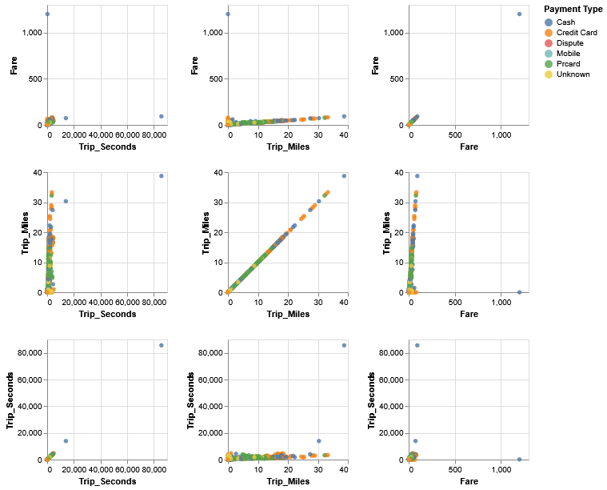
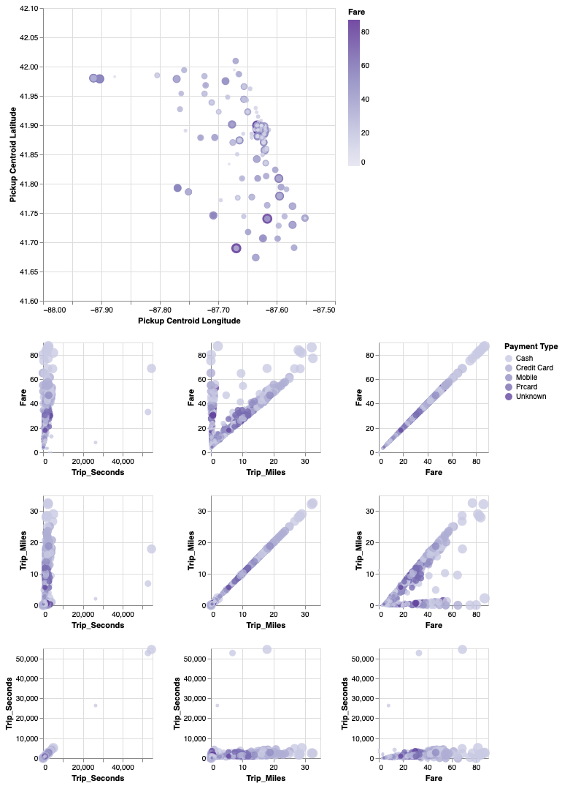

# Lab 3: Visualizing data with GeoPandas and Altair

The goal of this project is to visualize and analyze taxi trip data from Chicago using GeoPandas and Altair. It provides interactive bubble plots that depict the geographic distribution of taxi pickups throughout the city. Users can filter and examine data points in real-time using the integrated brush selection tools, allowing for more dynamic data interaction. This method provides an entertaining way to evaluate patterns and trends in taxi travel data while allowing users to concentrate on specific regions of interest in the city.

# Task 0 
To begin this project, install the necessary components and download the datasets (Taxi_Trips.csv and Chicago.geojson). After configuring your environment, run the code in Jupyter Notebook or Python IDE. The project will walk you through the procedures of processing and visualizing the data, resulting in interactive charts that allow for a comprehensive examination of the taxi trip data. As you go, you'll be able to filter and analyze the data based on various criteria, providing a hands-on approach to working with geographical data using Python.

The library we need to install is:
~~~bash
pip install geopandas altair pandas jupyter
~~~

# Task 1: Loading the data and initial exploration
Import the necessary libraries and load the data:
~~~bash
import pandas as pd
import geopandas as gpd
import altair as alt
from shapely.geometry import Point

df = pd.read_csv('data/Taxi_Trips.csv')
geometry = [Point(xy) for xy in zip(df['Pickup Centroid Longitude'], df['Pickup Centroid Latitude'])]
gdf = gpd.GeoDataFrame(df, geometry=geometry, crs=4326).sample(1000)
gdf = gdf.rename(columns={"Trip Seconds": "Trip_Seconds", "Trip Miles": "Trip_Miles"})
~~~
Note that we are renaming certain columns to remove white spaces. To display the first few rows:
~~~bash
gdf.head()
~~~

# Task 2: Performing spatial operations
Load the Chicago ZIP code boundaries dataset:
~~~bash
chicago = gpd.read_file('data/chicago.geojson')
~~~
Perform a spatial join between taxi trip data and Chicago ZIP codes to aggregate fare data by ZIP code:
~~~bash
joined = gpd.sjoin(gdf, chicago, predicate='within')
joined = joined.groupby('zip').mean()
joined = joined.filter(['Fare'])
~~~
Merge the aggregated data back with the Chicago ZIP code boundaries:
~~~bash
merged = chicago.merge(joined, on='zip')
~~~

# Task 3: Creating linked views
Create a basic linked view with scatter plots using Altair:
~~~bash
brush = alt.selection_interval()

matrix = alt.Chart(gdf).mark_circle().add_params(brush).encode(
    alt.X(alt.repeat("column"), type='quantitative'),
    alt.Y(alt.repeat("row"), type='quantitative'),
    color=alt.condition(brush, 'Payment Type:N', alt.value('grey')),
    opacity=alt.condition(brush, alt.value(0.8), alt.value(0.1))
).properties(
    width=150,
    height=150
).repeat(
    row=['Fare', 'Trip_Miles', 'Trip_Seconds'],
    column=['Trip_Seconds', 'Trip_Miles', 'Fare']
)

matrix
~~~

# Task 4: Link the scatter plots with a visualization of the spatial attributes
# Bubble Plot
~~~bash
import altair as alt

brush = alt.selection_interval()

# Bubble plot for spatial attributes (Pickup locations)
bubble_scatter = alt.Chart(gdf).mark_circle().encode(
    x=alt.X('Pickup Centroid Longitude', scale=alt.Scale(domain=[-88.0, -87.5])),
    y=alt.Y('Pickup Centroid Latitude', scale=alt.Scale(domain=[41.6, 42.1])),
    size=alt.Size('Fare', scale=alt.Scale(range=[10, 200]), legend=None),
    color=alt.Color('Fare', scale=alt.Scale(scheme='purples')),
    opacity=alt.condition(brush, alt.value(0.8), alt.value(0.1))
).add_params(brush).properties(
    width=400,
    height=400
)

# Bubble matrix for linking
bubble_matrix = alt.Chart(gdf).mark_circle().encode(
    alt.X(alt.repeat("column"), type='quantitative'),
    alt.Y(alt.repeat("row"), type='quantitative'),
    size=alt.Size('Fare', scale=alt.Scale(range=[10, 200]), legend=None),
    color=alt.condition(brush, alt.Color('Payment Type:N', scale=alt.Scale(scheme='purples')), alt.value('grey')),
    opacity=alt.condition(brush, alt.value(0.8), alt.value(0.1))
).properties(
    width=150,
    height=150
).repeat(
    row=['Fare', 'Trip_Miles', 'Trip_Seconds'],
    column=['Trip_Seconds', 'Trip_Miles', 'Fare']
).add_params(brush)

# Combine both charts
(bubble_scatter & bubble_matrix)
~~~

